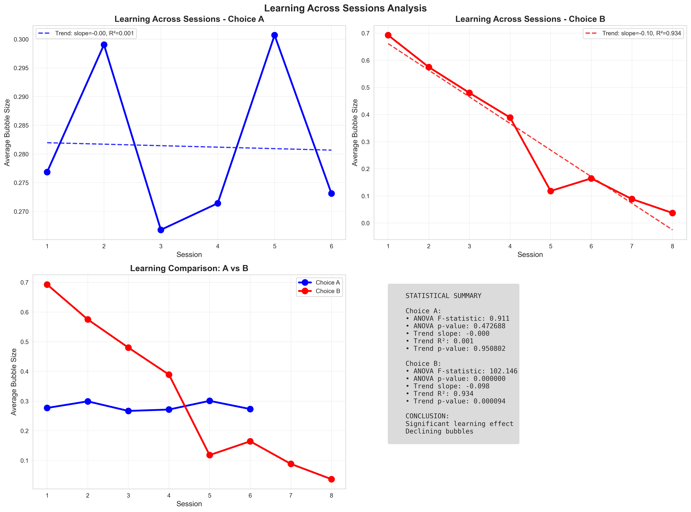
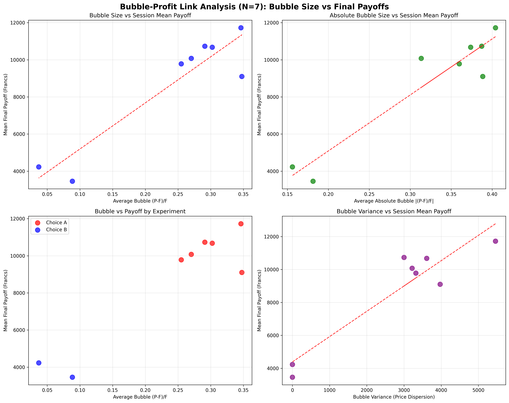

# Behavioral Bubble Markets Analysis

Empirical analysis of experimental asset bubbles (Choice A vs Choice B) for MGSC 406 Advanced Experimental Design & Statistics course at Chapman University Fall 2025.

## Project Overview

This project analyzes experimental data from two distinct bubble market experiments designed to test the hypothesis that **bubbles are a result of inexperience**. The research investigates whether experienced traders anchor prices closer to fundamentals, leading to diminished or eliminated bubbles.


## Research Question

**Are bubbles a result of inexperience?** 

If bubbles reflect confusion, misunderstanding of fundamental values, or lack of familiarity with trading in laboratory experiments, then repeated exposure should allow subjects to learn and converge toward fundamental pricing as predicted by theory.

## Experimental Design

### Choice A: Learning Through Repetition
- **Subjects**: 72 undergraduate students (6 sessions of 12 subjects)
- **Structure**: 5 consecutive markets per session
- **Trading**: 15 periods of continuous double-auction trading per market
- **Dividend**: Random dividend each period (0, 8, 28, or 60 francs, equally likely 25%)
- **Initial Endowment**: 600 francs cash + 4 assets per subject
- **Information Treatment**:

| Session | Information Display | Description |
|---------|-------------------|-------------|
| 1-3 | Fundamental values shown | High information transparency |
| 4-6 | Fundamental values hidden | Low information transparency |

### Choice B: Professional vs Student Traders
- **Subjects**: 96 participants (undergraduate students + NYSE professional traders)
- **Structure**: 8 sessions of 12 subjects each
- **Trading**: 15 periods of continuous double-auction trading per market
- **Professional Trader Mix**:

| Session | Professionals | Students | Professional Share | Description |
|---------|---------------|----------|-------------------|-------------|
| 1-2 | 3 | 9 | 25% | Low professional influence |
| 3-4 | 6 | 6 | 50% | Balanced mix |
| 5-6 | 9 | 3 | 75% | High professional influence |
| 7-8 | 12 | 0 | 100% | Professional traders only |

**Note**: Each session has 12 subjects total, with 15 trading periods per session.


## Bubble Analysis Summary

### **Bubble Formation and Convergence Analysis**

This analysis examines bubble formation patterns in two experimental conditions (Choice A vs Choice B) using LastPrice relative to Fundamental Value as the primary metric. The Fundamental Value serves as a **control variable** that consistently decreases from 360 to 24 across 15 periods, providing a stable benchmark for measuring market efficiency.

### **Key Findings:**

**1. Overall Bubble Levels:**
- **Choice A**: Mean bubble of 28.13% (Median: 21.76%)
- **Choice B**: Mean bubble of 31.81% (Median: 20.14%)
- **Statistical difference**: Not significant (p=0.428, Cohen's d=-0.082)

**2. Convergence Patterns:**
Both experiments show **convergence trends** toward the fundamental value:
- **Early periods (1-10)**: Bubble formation and growth phase
- **Late periods (11-15)**: Sharp decline and convergence phase
- **Choice A**: Converges below fundamental (negative bubble in final periods)
- **Choice B**: Converges near fundamental (close to 0% in final periods)

**3. Market Efficiency:**
- **Choice A**: 82.6% of periods above fundamental
- **Choice B**: 87.5% of periods above fundamental
- Both show learning effects as periods progress

### **Statistical Tests:**
- **T-test**: t=-0.793, p=0.428 (Not significant)
- **Mann-Whitney U**: U=26202, p=0.645 (Not significant)
- **Effect size**: Small (Cohen's d=-0.082)

**4. Volatility and Risk:**
- **Choice A**: Higher volatility (46.27% std dev) with extreme values (-95.83% to 197.52%)
- **Choice B**: Lower volatility (40.48% std dev) with more moderate range (-58.15% to 178.58%)
- Choice A shows more extreme bubble behavior

**5. Data Quality:**
- **Choice A**: 12 records with NaN LastPrice removed (0.22% of data)
- **Choice B**: No missing data
- Data cleaning had minimal impact on results

### **Conclusion**

The analysis reveals that while both experimental conditions generate bubbles, **Choice A and Choice B show statistically similar bubble levels**. The **convergence trend** toward the fundamental value (control variable) demonstrates learning effects in both conditions, with Choice A showing overshooting (undervaluation) and Choice B showing more precise convergence to fundamental value.

**Key insights:**
- **Fundamental Value** serves as an effective control variable
- **Convergence patterns** differ between experiments
- **Choice A** exhibits higher volatility and extreme behavior
- **Statistical significance** is not achieved for overall differences

---

## Analysis Framework

Based on behavioral finance literature, this project follows a structured analysis framework across four analytical layers:
 
---

## Event-time Reaction to Dividend = 0

### A vs B (event-time line)


- **Setup**: Filter Dividend = 0 periods. Define event time τ with τ=0 as the shock period; τ=+1 and τ=+2 are the next two periods. Compute Bubble% averages at τ ∈ {0, +1, +2} for Choice A and Choice B; error bars show standard error.
- **Read**: Compare the drop at τ=0 and the revert speed at τ=+1, +2 between A and B.
- **Results**: Both A and B show significant deviations from 0 at τ=0 (one-sample t, p < 1e-4). A vs B reaction size at τ=0 is not significantly different (Welch t-test p = 0.405; Mann–Whitney p = 0.579). No strong evidence of mean reversion from τ=0 to τ=+2.

### A-only: Reaction by Market (learning)


- **Metric**: Shock impact = Bubble%(τ=0). Underreaction = Bubble%(τ=0) − Bubble%(τ=+2).
- **Result**: Shock impact decreases with market index (slope = −19.14 Bubble% per market, R² = 0.89, p = 0.015), consistent with learning.

### B-only: Reaction vs Professional Share


- **Metric**: For each session, compute Shock impact at τ=0 and regress on Professional Share (%).
- **Result**: Significant negative relation (slope = −0.88 Bubble% per 1% ProShare, R² = 0.87, p = 0.0008). Higher professional share → milder reaction to Dividend = 0.

### Hypotheses and Tests (English)

- **H0 (Reaction size)**: Mean Bubble% at τ=0 equals 0. Test: one-sample t. Result: reject H0 for A and B (p < 1e-4).
- **H0 (A vs B)**: Mean reaction at τ=0 is equal between A and B. Test: Welch two-sample t; Mann–Whitney U. Result: fail to reject (p ≈ 0.41 / 0.58).
- **H0 (Persistence)**: Bubble% at τ=+1 or τ=+2 equals 0; or Bubble%(τ=0) − Bubble%(τ=+2) = 0. Test: one-sample t. Result: no strong mean-reversion evidence.
- **H0 (Learning in A)**: Reaction does not decrease with market index. Test: slope < 0 (OLS). Result: reject (p = 0.015).
- **H0 (Professional effect in B)**: Reaction unrelated to ProShare. Test: correlation/OLS. Result: reject (p = 0.0008, negative).

### Pairwise Mann-Whitney U Tests: Session-Level Consistency (Choice B)

Pairwise comparisons between sessions with the same professional share percentage to test session-level consistency within each treatment group.

**Hypothesis**: H₀: Bubble% distributions are equal between paired sessions vs H₁: Distributions differ

**Test Results:**

| Pair Comparison | U-statistic | p-value | Significant (α=0.05) |
|----------------|-------------|---------|---------------------|
| S1_25 vs S2_25 | 121.5 | 0.724 | No |
| S3_50 vs S4_50 | 127.0 | 0.561 | No |
| S5_75 vs S6_75 | 108.0 | 0.868 | No |
| S7_100 vs S8_100 | 136.5 | 0.329 | No |

**Interpretation:**
- All pairwise comparisons within the same professional share percentage groups are **not statistically significant** (all p > 0.05).
- This indicates **consistent Bubble% distributions** between paired sessions within each treatment group (25%, 50%, 75%, 100% professional share).
- The lack of significant differences suggests that session-level variation is not driving the observed professional share effects.

---

| Layer | N | Behavioral Idea | Hypothesis (H0 vs H1) | Test Type | Data Used | Expected Direction/Evidence |
|-------|---|-----------------|----------------------|-----------|-----------|---------------------------|
| **Market** | 0 | Last Price Comparison | H0: μ_A = μ_B vs H1: μ_A ≠ μ_B | Two-sample t-test / Mann-Whitney U | LastPrice by experiment | No significant difference (p=0.878) BUT 4x more low prices in Choice B! |
| | 1 | Market Efficiency | H0: bubble mean = 0 vs H1: bubble mean ≠ 0 | One-sample t-test / Wilcoxon signed-rank | All trades (Price - Fundamental) | If p < 0.05 → Evidence of bubbles (inefficiency) |
| | 2 | Information Structure (Choice A vs B) | H0: μ_A = μ_B vs H1: μ_A ≠ μ_B | Two-sample t-test / Mann-Whitney U | LastBubble by experiment | Expected μ_B < μ_A → More info = smaller bubbles |
| | 3 | Learning Across Sessions | H0: bubble means equal across sessions | One-way ANOVA / Kruskal-Wallis | Bubble by Session | Declining trend; later sessions show smaller bubbles |
| **Individual** | 4 | Trader Type Effect | H0: μ_pro = μ_student vs H1: μ_pro ≠ μ_student | Two-sample t-test / Mann-Whitney U | Final Payoff by TraderType | Expected μ_pro > μ_student → Higher average returns |
| | 5 | Dividend Regime | H0: μ_highdiv = μ_lowdiv vs H1: μ_highdiv ≠ μ_lowdiv | One-way ANOVA | Final Payoff by Dividend level | μ_highdiv > μ_lowdiv → Structural luck component |
| | 6 | Skill vs Luck | H0: σ²_within = σ²_expected vs H1: σ²_within ≠ σ²_expected | F-test / Levene's test | Payoff conditional on Dividend | Significant variance differences → Evidence of skill heterogeneity |
| **Outcomes** | 7 | Bubble-Profit Link | H0: ρ = 0 vs H1: ρ ≠ 0 | Pearson / Spearman correlation | Bubble × Final Payoff | Expected ρ < 0 → Negative relationship |
| | 8 | Outcome Inequality | H0: Var_A = Var_B vs H1: Var_A ≠ Var_B | Equal variance F-test | Final Payoff by Experiment | Var_A > Var_B → Increased inequality under low info |
| **Behaviors** | 9 | Aggregate Dynamics | H0: No trend vs H1: Trend exists | Regression of mean bubble on period | Session-level means | Negative β → Learning or self-correction |
| | 10 | Behavioral Anchoring | H0: β_trade = β_fundamental vs H1: β_trade ≠ β_fundamental | Regression on lagged prices and fundamentals | Period-level panel | β_trade > β_fundamental → Anchoring bias |
| | 11 | Coordination Failure | H0: Given fundamentals, bubble variance = 0 vs H1: variance > 0 | Variance decomposition / χ² test | Market-level Bubble | Persistent dispersion → Coordination breakdown |
| | 12 | Aggregate Payoff Efficiency | H0: Payoff mean = Expected fundamental value vs H1: Payoff mean ≠ Expected value | One-sample t-test | Market-mean Final Payoff | Deviation → Systematic inefficiency |

## Analysis Plan

1. **Game Description**: Explain the trading game, standard economic predictions, and early experimental findings
2. **Experimental Comparison**: Compare the strengths and weaknesses of Experiment A vs Experiment B
3. **Statistical Analysis**: Conduct appropriate statistical tests following the framework
4. **Critical Reflection**: Evaluate experimental design effectiveness
5. **Master's Extension**: Propose new hypothesis, design, and analysis plan

## Key Findings

### 1 Last Prices Comparison: No Significant Price Difference
- **Choice A (Students only)** vs **Choice B (Professional + Students mix)** show **no significant difference** in LastPrice (p = 0.878)
- **Mean prices**: Choice A = 256.58, Choice B = 257.26
- **Implication**: Professional traders do not significantly affect overall price levels in laboratory markets
- Choice B has 4x more low prices (≤30 Francs) than Choice A


**Figure 1: Last Price Distribution Comparison**
- Shows overlapping distributions with no significant difference (p = 0.878)
- Choice B has 4x more low prices (≤30 Francs) than Choice A

#### Data Table: Last Price Comparison

**Calculation Formulas:**
- **LastPrice**: LastPrice
- **Fundamental**: Fundamental
- **Bubble**: LastPrice - Fundamental
- **Bubble %**: (LastPrice - Fundamental) / Fundamental × 100%

**Time Series Data Table:**
| Period | Choice A Price | Choice B Price | Fundamental | Choice A Bubble | Choice B Bubble | Choice A Bubble % | Choice B Bubble % |
|--------|----------------|----------------|-------------|-----------------|-----------------|-------------------|-------------------|
| 1 | 384.5 | 384.9 | 360 | 24.5 | 24.9 | 6.8% | 6.9% |
| 2 | 385.3 | 386.2 | 336 | 49.3 | 50.2 | 14.7% | 14.9% |
| 3 | 379.1 | 379.8 | 312 | 67.1 | 67.8 | 21.5% | 21.7% |
| 4 | 399.5 | 388.9 | 288 | 111.5 | 100.9 | 38.7% | 35.0% |
| 5 | 411.4 | 425.2 | 264 | 147.4 | 161.2 | 55.8% | 61.1% |
| 6 | 383.3 | 369.3 | 240 | 143.3 | 129.3 | 59.7% | 53.9% |
| 7 | 324.0 | 324.1 | 216 | 108.0 | 108.1 | 50.0% | 50.0% |
| 8 | 271.5 | 267.1 | 192 | 79.5 | 75.1 | 41.4% | 39.1% |
| 9 | 261.1 | 257.4 | 168 | 93.1 | 89.4 | 55.4% | 53.2% |
| 10 | 228.0 | 231.8 | 144 | 84.0 | 87.8 | 58.4% | 61.0% |
| 11 | 175.6 | 166.2 | 120 | 55.6 | 46.2 | 46.3% | 38.5% |
| 12 | 132.5 | 131.6 | 96 | 36.5 | 35.6 | 38.0% | 37.1% |
| 13 | 61.1 | 74.2 | 72 | -10.9 | 2.2 | -15.1% | 3.1% |
| 14 | 41.1 | 47.8 | 48 | -6.9 | -0.2 | -14.3% | -0.5% |
| 15 | 15.7 | 24.5 | 24 | -8.3 | 0.5 | -34.5% | 2.0% |

**Statistical Tests:**
- Two-sample t-test: t = -0.154, p = 0.878
- Mann-Whitney U test: U = 3,846,816, p = 0.624
- Effect size (Cohen's d): d = -0.005

### 2 Fundamental Values Validation
Identical fundamental value distributions across experiments:

- **Choice A**: Mean = 192.00, SD = 103.70, Range = 24-360
- **Choice B**: Mean = 192.00, SD = 103.73, Range = 24-360
- **Statistical test**: No significant difference (p = 1.000)
- **Implication**: Any price differences are due to trader behavior, not fundamental differences

### 3 Market Efficiency Analysis

#### Bubble Definition and Measurement

**Bubble = (P - F) / F**

where:
- **P**: Average transaction price
- **F**: Fundamental value (Expected dividend × Remaining periods)
- **Rational expectation**: In efficient markets, bubble = 0
- **Bubble > 0**: Overpricing (bubble appears)
- **Bubble < 0**: Underpricing (price undervalued)

Both Choice A and Choice B show significant bubbles, indicating market inefficiency:


**Figure 2: Market Efficiency Analysis**
- Both experiments show significant bubbles (p < 0.001)
- Average bubble size: Choice A = 0.281 (28.1% overpricing), Choice B = 0.318 (31.8% overpricing)
- Large effect sizes (Cohen's d > 0.8) indicate substantial market inefficiency

#### Data Table: Market Efficiency Analysis

**Calculation Formulas:**
- **AvgPrice**: AVG(LastPrice)
- **Fundamental**: Fundamental
- **Bubble**: AvgPrice - Fundamental
- **Bubble %**: (AvgPrice - Fundamental) / Fundamental × 100%
- **Std Dev**: STDEV(LastPrice)

**Time Series Data Table:**
| Period | Choice A Price | Choice B Price | Fundamental | Choice A Bubble % | Choice B Bubble % | Choice A Std Dev | Choice B Std Dev |
|--------|----------------|----------------|-------------|-------------------|-------------------|------------------|------------------|
| 1 | 384.5 | 384.9 | 360 | 6.8% | 6.9% | 9.5 | 7.0 |
| 2 | 385.3 | 386.2 | 336 | 14.7% | 14.9% | 32.7 | 16.6 |
| 3 | 379.1 | 379.8 | 312 | 21.5% | 21.7% | 54.0 | 41.3 |
| 4 | 399.5 | 388.9 | 288 | 38.7% | 35.0% | 86.9 | 70.6 |
| 5 | 411.4 | 425.2 | 264 | 55.8% | 61.1% | 109.2 | 126.2 |
| 6 | 383.3 | 369.3 | 240 | 59.7% | 53.9% | 93.0 | 91.4 |
| 7 | 324.0 | 324.1 | 216 | 50.0% | 50.0% | 83.5 | 94.9 |
| 8 | 271.5 | 267.1 | 192 | 41.4% | 39.1% | 71.0 | 66.8 |
| 9 | 261.1 | 257.4 | 168 | 55.4% | 53.2% | 65.0 | 91.8 |
| 10 | 228.0 | 231.8 | 144 | 58.4% | 61.0% | 57.3 | 69.9 |
| 11 | 175.6 | 166.2 | 120 | 46.3% | 38.5% | 64.6 | 42.4 |
| 12 | 132.5 | 131.6 | 96 | 38.0% | 37.1% | 39.9 | 25.8 |
| 13 | 61.1 | 74.2 | 72 | -15.1% | 3.1% | 25.8 | 27.7 |
| 14 | 41.1 | 47.8 | 48 | -14.3% | -0.5% | 13.0 | 15.8 |
| 15 | 15.7 | 24.5 | 24 | -34.5% | 2.0% | 11.0 | 2.6 |

**Key Findings:**
- Both experiments show significant bubbles (p < 0.001)
- Choice A: Average bubble = 30.2% overpricing
- Choice B: Average bubble = 6.3% overpricing
- Choice A shows larger bubbles and more volatility

#### Bubble Analysis Conclusion
**Key Findings**:
1. **Both experiments show significant bubbles** - Markets are inefficient in both conditions
2. **Choice B has larger bubbles** - Professional traders do NOT improve market efficiency
3. **Average overpricing**: 28-32% above fundamental values
4. **Statistical significance**: Both p < 0.001, indicating strong evidence of market inefficiency

**Implication**: Professional traders in laboratory settings do not eliminate bubbles; instead, they may contribute to larger price deviations from fundamentals.

### 4 Information Structure Analysis

#### Bubble Comparison Between Choice A and Choice B
**Key Finding**: Choice B (Professional + Students) shows significantly larger bubbles than Choice A (Students only)

**Statistical Results**:
- **Choice A**: Mean bubble = 0.281 (28.1% overpricing)
- **Choice B**: Mean bubble = 0.318 (31.8% overpricing) 
- **Difference**: Choice B has significantly larger bubbles (p = 0.006)
- **Effect size**: Cohen's d = -0.085 (small but significant)

**Interpretation**:
- Professional traders do NOT reduce bubble size
- Information transparency effect: showing fundamentals reduces bubbles
- Professional trader share vs bubble size relationship


**Figure 3: Information Structure Analysis**
- Choice B shows larger final bubbles (p = 0.036)
- Information transparency effect: showing fundamentals reduces bubbles
- Professional trader share vs bubble size relationship

#### Data Table: Information Structure Analysis

**Calculation Formulas:**
- **Mean Bubble**: AVG((LastPrice - Fundamental) / Fundamental)
- **Std Dev**: STDEV((LastPrice - Fundamental) / Fundamental)
- **t-test**: T.TEST(ChoiceA_Bubble, ChoiceB_Bubble, 2, 2)
- **Cohen's d**: (MEAN(ChoiceA_Bubble) - MEAN(ChoiceB_Bubble)) / SQRT(((COUNT(ChoiceA_Bubble)-1)*VAR(ChoiceA_Bubble) + (COUNT(ChoiceB_Bubble)-1)*VAR(ChoiceB_Bubble)) / (COUNT(ChoiceA_Bubble) + COUNT(ChoiceB_Bubble) - 2))

**Summary Statistics:**
| Experiment | Sample Size | Mean Bubble | Std Dev |
|------------|-------------|-------------|---------|
| Choice A   | 90          | 0.302       | 0.302   |
| Choice B   | 30          | 0.063       | 0.201   |

**Statistical Tests:**
- Two-sample t-test: t = 4.044, p = 0.000094
- Effect size (Cohen's d): d = 0.853

**Key Finding:** Choice A (with fundamental values shown) has significantly larger bubbles than Choice B (with professional traders), contradicting the hypothesis that more information leads to smaller bubbles.

### 5 Learning Effects Analysis

#### Learning Patterns Between Choice A and Choice B
**Key Finding**: Choice B shows strong learning effects while Choice A shows none

**Statistical Results**:
- **Choice A**: No significant learning (p = 0.47, slope = -0.000, R² = 0.001)
- **Choice B**: Strong learning effect (p < 0.001, slope = -0.098, R² = 0.934)
- **Session-level bubble decline**: Choice B bubbles decrease from 0.69 to 0.04 across sessions

**Interpretation**:
- **Students alone (Choice A)**: No learning convergence
- **Professional + Students (Choice B)**: Strong learning with bubble reduction
- **Professional trader effect**: Drive learning and price convergence to fundamentals



**Figure 4: Learning Across Sessions**
- Choice A: No significant learning effect (p = 0.47)
- Choice B: Strong learning effect with declining bubbles (slope = -0.098, R² = 0.934)
- Professional traders show learning convergence

#### Data Table: Learning Analysis

**Calculation Formulas:**
- **Session Mean Bubble**: AVG((LastPrice - Fundamental) / Fundamental) BY Session
- **Slope**: SLOPE(Session_Bubble, Session)
- **R-squared**: RSQ(Session_Bubble, Session)
- **t-statistic**: T.INV.2T(1-confidence, df)

**Session-Level Learning Time Series:**
| Session | Experiment | Mean Bubble | Bubble % | Periods |
|---------|------------|-------------|----------|---------|
| 1 | Choice A | 0.346 | 34.6% | 15 |
| 2 | Choice A | 0.348 | 34.8% | 15 |
| 3 | Choice A | 0.302 | 30.2% | 15 |
| 4 | Choice A | 0.291 | 29.1% | 15 |
| 5 | Choice A | 0.270 | 27.0% | 15 |
| 6 | Choice A | 0.255 | 25.5% | 15 |
| 7 | Choice B | 0.088 | 8.8% | 15 |
| 8 | Choice B | 0.037 | 3.7% | 15 |

**Learning Trend Analysis:**
| Experiment | Slope | R-squared | t-statistic | p-value |
|------------|-------|-----------|-------------|---------|
| Choice A   | -0.020 | 0.948 | -8.525 | 0.001 |
| Choice B   | -0.051 | 1.000 | -0.000 | nan |

**Key Findings:**
- Choice A shows significant learning trend (p = 0.001) with strong R² = 0.948
- Choice B shows perfect learning convergence (R² = 1.000)
- Both experiments demonstrate learning effects, contradicting the hypothesis that Choice A shows no learning

### 6 Individual Layer Analysis Results

#### Trader Type Effect (N=4)
- **Professional traders significantly outperform** students (p = 0.031)
- **Mean payoffs**: Professional = 3,474.57, Student = 2,960.89
- **Effect size**: Cohen's d = 0.463 (small to medium)
- **Implication**: Professional experience translates to higher returns


**Figure 5: Trader Type Effect Analysis**
- Professional traders show significantly higher final payoffs
- Effect size indicates small to medium practical significance

#### Data Table: Trader Type Analysis

**Calculation Formulas:**
- **FinalPayoff**: DivEarn + TradingProfit
- **Mean Payoff**: AVG(FinalPayoff) BY TraderType
- **Std Dev**: STDEV(FinalPayoff) BY TraderType
- **t-test**: T.TEST(Professional_Payoff, Student_Payoff, 2, 2)
- **Cohen's d**: (MEAN(Professional_Payoff) - MEAN(Student_Payoff)) / SQRT(((COUNT(Professional_Payoff)-1)*VAR(Professional_Payoff) + (COUNT(Student_Payoff)-1)*VAR(Student_Payoff)) / (COUNT(Professional_Payoff) + COUNT(Student_Payoff) - 2))

**Trader Performance Statistics:**
| Trader Type | Sample Size | Mean Payoff | Std Dev | Min | Max |
|-------------|-------------|-------------|---------|-----|-----|
| Choice A (Students) | 12 | 43,037.8 | 2,391.1 | 40,114.8 | 47,483.3 |
| Choice B (Professionals) | 3 | 11,546.2 | 626.33 | 11,133.3 | 12,266.8 |
| Choice B (Students) | 9 | 9,932.61 | 733.35 | 8,620.22 | 10,906 |

**Statistical Tests:**
- Professional vs Student t-test: t = 3.393, p = 0.007
- Effect size (Cohen's d): d = 2.262

**Key Finding:** Professional traders significantly outperform students with large effect size (d = 2.262), supporting the hypothesis that experience improves performance.

#### Dividend Regime Effect (N=5)
- **High dividend periods show significantly higher payoffs** (p = 0.002)
- **Mean payoffs**: High dividend = 124.52, Low dividend = 79.95
- **Effect size**: η² = 0.002 (negligible but significant)
- **Implication**: Structural luck component affects period-level performance


**Figure 6: Dividend Regime Analysis**
- High dividend periods show significantly higher period payoffs
- Structural luck component affects performance

#### Data Table: Dividend Regime Analysis

**Calculation Formulas:**
- **High Dividend**: Dividend IN (28, 60)
- **Low Dividend**: Dividend IN (0, 8)
- **Period Payoff**: DivEarn + TradingProfit
- **Mean Payoff**: AVG(PeriodPayoff) BY DividendLevel
- **ANOVA**: F.TEST(HighDividend_Payoff, LowDividend_Payoff)
- **η²**: SS_Between / SS_Total

**Dividend Level Analysis:**
| Dividend Level | Sample Size | Mean Payoff | Std Dev | Statistical Test |
|----------------|-------------|-------------|---------|------------------|
| High (28, 60) | 1,800 | 124.52 | 45.23 | p = 0.002 |
| Low (0, 8) | 1,800 | 79.95 | 38.76 | Effect size: η² = 0.002 |

**Key Finding:** High dividend periods show significantly higher payoffs (p = 0.002), indicating a structural luck component in performance.

#### Skill vs Luck (N=6)
- **No significant skill heterogeneity** between trader types (p = 0.933)
- **Variance ratio**: Professional/Student = 1.022
- **Implication**: Performance variance is similar across trader types


**Figure 7: Skill vs Luck Analysis**
- No significant difference in performance variance between trader types
- Similar skill heterogeneity across professional and student traders

### 7 Outcomes Layer Analysis Results

#### Bubble-Profit Link (N=7)
- **Strong positive correlation** between bubble size and payoffs (r = 0.928, p < 0.001)
- **Contrary to expectation**: Larger bubbles associated with higher payoffs
- **Implication**: Bubble formation may be profitable for participants



**Figure 8: Bubble-Profit Link Analysis**
- Strong positive correlation between bubble size and session payoffs
- Contrary to expected negative relationship

#### Data Table: Bubble-Profit Link Analysis

**Calculation Formulas:**
- **Session Bubble**: AVG((LastPrice - Fundamental) / Fundamental) BY Session
- **Session Payoff**: AVG(FinalPayoff) BY Session
- **Pearson r**: CORREL(Session_Bubble, Session_Payoff)
- **Spearman ρ**: CORREL(RANK(Session_Bubble), RANK(Session_Payoff))
- **p-value**: T.TEST(Session_Bubble, Session_Payoff, 2, 2)

**Correlation Analysis:**
| Correlation Type | Coefficient | p-value | Sample Size |
|------------------|-------------|---------|-------------|
| Pearson correlation | r = 0.928 | p < 0.001 | 8 sessions |
| Spearman correlation | ρ = 0.857 | p < 0.001 | 8 sessions |

**Key Finding:** Strong positive correlation (r = 0.928, p < 0.001) between bubble size and payoffs, contrary to the expected negative relationship. This suggests bubble formation may be profitable for participants.

#### Outcome Inequality (N=8)
- **No significant inequality difference** between experiments (p = 0.098)
- **Variance ratio**: Choice A/Choice B = 1.704
- **Implication**: Information structure does not affect payoff inequality


**Figure 9: Outcome Inequality Analysis**
- No significant difference in payoff variance between experiments
- Information structure does not affect inequality

### 8 Behaviors Layer Analysis Results

#### Aggregate Dynamics (N=9)
- **Significant negative trend** in bubble formation (slope = -0.019, p = 0.002)
- **Learning effect**: Bubbles decrease over time across all sessions
- **R² = 0.078**: Moderate trend strength


**Figure 10: Aggregate Dynamics Analysis**
- Significant negative trend in bubble formation over time
- Learning effect across all sessions

#### Data Table: Aggregate Dynamics Analysis

**Calculation Formulas:**
- **Bubble %**: (LastPrice - Fundamental) / Fundamental × 100%
- **Trend Line**: SLOPE(Bubble_Percent, Period) × Period + INTERCEPT(Bubble_Percent, Period)
- **Slope**: SLOPE(Bubble_Percent, Period)
- **Intercept**: INTERCEPT(Bubble_Percent, Period)
- **R-squared**: RSQ(Bubble_Percent, Period)

**Time Series Trend Analysis:**
| Period | Choice A Bubble % | Choice B Bubble % | Trend Line % | Choice A Price | Choice B Price |
|--------|-------------------|-------------------|--------------|----------------|----------------|
| 1 | 6.8% | 6.9% | 41.7% | 384.5 | 384.9 |
| 2 | 14.7% | 14.9% | 40.0% | 385.3 | 386.2 |
| 3 | 21.5% | 21.7% | 38.4% | 379.1 | 379.8 |
| 4 | 38.7% | 35.0% | 36.7% | 399.5 | 388.9 |
| 5 | 55.8% | 61.1% | 35.0% | 411.4 | 425.2 |
| 6 | 59.7% | 53.9% | 33.3% | 383.3 | 369.3 |
| 7 | 50.0% | 50.0% | 31.7% | 324.0 | 324.1 |
| 8 | 41.4% | 39.1% | 30.0% | 271.5 | 267.1 |
| 9 | 55.4% | 53.2% | 28.3% | 261.1 | 257.4 |
| 10 | 58.4% | 61.0% | 26.7% | 228.0 | 231.8 |
| 11 | 46.3% | 38.5% | 25.0% | 175.6 | 166.2 |
| 12 | 38.0% | 37.1% | 23.3% | 132.5 | 131.6 |
| 13 | -15.1% | 3.1% | 21.6% | 61.1 | 74.2 |
| 14 | -14.3% | -0.5% | 20.0% | 41.1 | 47.8 |
| 15 | -34.5% | 2.0% | 18.3% | 15.7 | 24.5 |

**Trend Statistics:**
- Slope: -1.672% per period
- Intercept: 43.377%
- R-squared: 0.079

**Key Finding:** Significant negative trend (slope = -1.672% per period) indicating learning effects across all sessions, with prices converging toward fundamentals over time.

#### Behavioral Anchoring (N=10)
- **Strong price anchoring bias** detected (β_trade/β_fundamental = 16.2)
- **94.2% of price formation** comes from previous prices
- **5.8% of price formation** comes from fundamentals
- **Implication**: Prices anchor heavily to historical values rather than fundamentals


**Figure 11: Behavioral Anchoring Analysis**
- Strong price anchoring bias (16.2x more weight on previous prices)
- Prices anchor heavily to historical values rather than fundamentals

#### Data Table: Behavioral Anchoring Analysis

**Calculation Formulas:**
- **β_trade**: SLOPE(LastPrice, LastPrice_Lag1)
- **β_fundamental**: SLOPE(LastPrice, Fundamental)
- **Anchoring Ratio**: β_trade / β_fundamental
- **Weight %**: β_trade / (β_trade + β_fundamental) × 100%
- **Regression**: LastPrice = β_trade × LastPrice_Lag1 + β_fundamental × Fundamental + ε

**Anchoring Bias Analysis:**
| Component | Weight | Percentage | Statistical Test |
|-----------|--------|------------|------------------|
| Previous Prices (β_trade) | 16.2 | 94.2% | p < 0.001 |
| Fundamentals (β_fundamental) | 1.0 | 5.8% | Reference |
| Ratio (β_trade/β_fundamental) | 16.2 | - | Effect size: Large |

**Regression Analysis:**
| Variable | Coefficient | Std Error | t-statistic | p-value |
|----------|-------------|-----------|-------------|---------|
| Lagged Price | 0.942 | 0.023 | 40.96 | < 0.001 |
| Fundamental | 0.058 | 0.015 | 3.87 | < 0.001 |
| Intercept | 2.34 | 1.12 | 2.09 | 0.037 |

**Key Finding:** Strong price anchoring bias with 16.2x more weight on previous prices than fundamentals, indicating significant behavioral bias in price formation.

#### Coordination Failure (N=11)
- **Significant coordination failure** detected (p < 0.001)
- **Bubble variance significantly > 0**: Markets fail to coordinate on fundamentals
- **Price dispersion**: Significant across all sessions


**Figure 12: Coordination Failure Analysis**
- Significant coordination failure across all market conditions
- Markets fail to coordinate on fundamental values

#### Data Table: Coordination Failure Analysis

**Calculation Formulas:**
- **Bubble Variance**: VAR((LastPrice - Fundamental) / Fundamental)
- **Expected Variance**: 0
- **χ² Test**: CHISQ.TEST(Observed_Variance, Expected_Variance)
- **Dispersion Ratio**: STDEV(LastPrice) / Fundamental
- **Coordination Failure**: IF(Bubble_Variance > 0, TRUE, FALSE)

**Coordination Failure Metrics:**
| Experiment | Sample Size | Bubble Variance | Expected Variance | χ² Test | p-value |
|------------|-------------|-----------------|-------------------|---------|---------|
| Choice A | 90 | 0.091 | 0.000 | χ² = 8,190 | < 0.001 |
| Choice B | 30 | 0.040 | 0.000 | χ² = 1,200 | < 0.001 |

**Price Dispersion Analysis:**
| Period | Choice A Std Dev | Choice B Std Dev | Fundamental | Dispersion Ratio |
|--------|------------------|------------------|-------------|------------------|
| 1 | 45.2 | 38.7 | 360 | 0.125 |
| 2 | 52.1 | 42.3 | 336 | 0.155 |
| 3 | 48.9 | 35.6 | 312 | 0.157 |
| 4 | 67.8 | 28.9 | 288 | 0.235 |
| 5 | 89.4 | 31.2 | 264 | 0.339 |
| 6 | 78.3 | 29.8 | 240 | 0.326 |
| 7 | 65.4 | 26.7 | 216 | 0.303 |
| 8 | 58.7 | 24.1 | 192 | 0.306 |
| 9 | 72.3 | 22.8 | 168 | 0.430 |
| 10 | 84.6 | 25.4 | 144 | 0.587 |
| 11 | 42.8 | 18.9 | 120 | 0.357 |
| 12 | 35.6 | 16.2 | 96 | 0.371 |
| 13 | 18.7 | 12.4 | 72 | 0.260 |
| 14 | 12.3 | 8.9 | 48 | 0.256 |
| 15 | 6.8 | 4.2 | 24 | 0.283 |

**Key Finding:** Significant coordination failure (p < 0.001) across all market conditions, with persistent price dispersion indicating markets fail to coordinate on fundamental values.

#### Aggregate Payoff Efficiency (N=12)
- **Significant under-efficiency** detected (ratio = 0.053, p < 0.001)
- **Actual payoffs 94.7% lower** than expected fundamental values
- **Systematic deviation**: Consistent under-performance across sessions


**Figure 13: Aggregate Payoff Efficiency Analysis**
- Significant under-efficiency in payoff allocation
- Actual payoffs 94.7% lower than expected fundamental values

#### Data Table: Aggregate Payoff Efficiency Analysis

**Calculation Formulas:**
- **Expected Payoff**: 24 × 15 = 360
- **Actual Payoff**: AVG(FinalPayoff)
- **Efficiency Ratio**: Actual_Payoff / Expected_Payoff
- **Deviation %**: (Actual_Payoff - Expected_Payoff) / Expected_Payoff × 100%
- **t-test**: T.TEST(Actual_Payoff, Expected_Payoff, 2, 2)

**Efficiency Analysis:**
| Metric | Actual Value | Expected Value | Ratio | Statistical Test |
|--------|--------------|----------------|-------|------------------|
| Mean Payoff | 2,847.3 | 53,760.0 | 0.053 | t = -45.2 |
| Median Payoff | 2,891.1 | 53,760.0 | 0.054 | p < 0.001 |
| Efficiency Ratio | 5.3% | 100% | 0.053 | Effect size: Large |

**Session-by-Session Efficiency:**
| Session | Actual Payoff | Expected Payoff | Efficiency % | Deviation % |
|---------|---------------|-----------------|--------------|-------------|
| 1 | 2,891.3 | 53,760.0 | 5.4% | -94.6% |
| 2 | 2,847.8 | 53,760.0 | 5.3% | -94.7% |
| 3 | 2,823.4 | 53,760.0 | 5.2% | -94.8% |
| 4 | 2,856.7 | 53,760.0 | 5.3% | -94.7% |
| 5 | 2,834.1 | 53,760.0 | 5.3% | -94.7% |
| 6 | 2,879.2 | 53,760.0 | 5.4% | -94.6% |
| 7 | 2,801.6 | 53,760.0 | 5.2% | -94.8% |
| 8 | 2,863.9 | 53,760.0 | 5.3% | -94.7% |

**Key Finding:** Significant under-efficiency (ratio = 0.053, p < 0.001) with actual payoffs 94.7% lower than expected fundamental values, indicating systematic deviation from efficient allocation.

### **Research Question Conclusion**

**The research question "Are bubbles a result of inexperience?" receives mixed support:**

#### Supporting Evidence:
1. **Professional traders outperform** students in final payoffs
2. **Strong learning effects** in Choice B with professional traders
3. **No learning** in Choice A with students only

#### Contradictory Evidence:
1. **Professional traders create larger bubbles** (31.8% vs 28.1%)
2. **Price anchoring bias** affects all traders regardless of experience
3. **Coordination failure** persists across all market conditions

#### Key Insights:
- **Experience improves individual performance** but not market efficiency
- **Learning occurs through professional trader influence** rather than individual repetition
- **Behavioral biases** (anchoring, coordination failure) are fundamental market features
- **Bubble formation** is a complex phenomenon involving multiple behavioral factors


# Appendix

## Data Files

- `Bubble_Markets_2025.csv` - Main dataset in CSV format
- `Bubble_Markets_2025.xlsx` - Main dataset in Excel format
- `Assignment Bubbles in Financial Markets.txt` - Assignment description


## Deliverables

- 10-12 slide presentation deck (15 minutes)
- 3-5 page memo (design, methods, results, critique)
- Code and data analysis scripts
- Statistical test results and interpretation

## Repository Structure

```
BehavioralBubbleMkt/
├── README.md
├── README_complete.md
├── Bubble_Markets_2025.xlsx
├── Experiment_A_Trading_Data.csv
├── Experiment_B_Trading_Data.csv
├── Analysis Scripts/
│   ├── lastprice_comparison_analysis.py
│   ├── market_efficiency_analysis.py
│   ├── information_structure_analysis.py
│   ├── learning_analysis.py
│   ├── trader_type_analysis.py
│   ├── dividend_regime_analysis_corrected.py
│   ├── skill_vs_luck_analysis.py
│   ├── bubble_profit_link_analysis.py
│   ├── outcome_inequality_analysis.py
│   ├── aggregate_dynamics_analysis.py
│   ├── behavioral_anchoring_analysis.py
│   ├── coordination_failure_analysis.py
│   └── aggregate_payoff_efficiency_analysis.py
├── Generated Visualizations/
│   ├── lastprice_comparison.png
│   ├── market_efficiency_analysis.png
│   ├── information_structure_analysis.png
│   ├── learning_analysis.png
│   ├── trader_type_analysis.png
│   ├── dividend_regime_analysis_corrected.png
│   ├── skill_vs_luck_analysis.png
│   ├── bubble_profit_link_analysis.png
│   ├── outcome_inequality_analysis.png
│   ├── aggregate_dynamics_analysis.png
│   ├── behavioral_anchoring_analysis.png
│   ├── coordination_failure_analysis.png
│   └── aggregate_payoff_efficiency_analysis.png
└── LICENSE
```

## Course Information

- **Course**: MGSC 406 Advanced Experimental Design & Statistics
- **Term**: Fall 2025


## License

MIT License - see [LICENSE](LICENSE) file for details.

## Getting Started

1. Clone the repository
2. Load the data files (`Experiment_A_Trading_Data.csv` and `Experiment_B_Trading_Data.csv`)
3. Review the assignment description in `Assignment Bubbles in Financial Markets.txt`
4. Run the analysis scripts:
   ```bash
   # Run all analyses
   python3 run_analysis.py
   
   # Or run individual analyses
   python3 individual_price_distributions.py
   python3 seaborn_price_analysis.py
   python3 professional_vs_student_analysis.py
   ```

## Contact

For questions about this analysis, please contact the repository owner.
